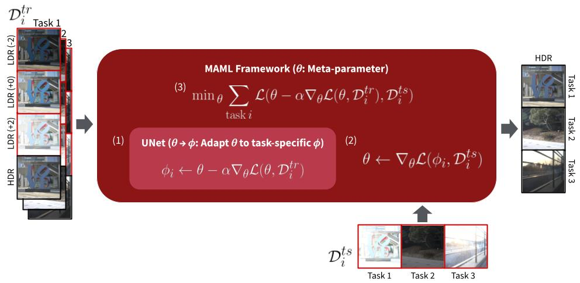

# MetaHDR: Model-Agnostic Meta-Learning for HDR Image Reconstruction
[](https://www.google.com/url?sa=i&url=https%3A%2F%2Ftenor.com%2Fsearch%2Fawkward-seal-gifs&psig=AOvVaw1bCPMztbOxyoQcICi_741A&ust=1616201758956000&source=images&cd=vfe&ved=0CAIQjRxqFwoTCPC4jPCSu-8CFQAAAAAdAAAAABAS) [](https://www.google.com/url?sa=i&url=https%3A%2F%2Ftenor.com%2Fsearch%2Fawkward-seal-gifs&psig=AOvVaw1bCPMztbOxyoQcICi_741A&ust=1616201758956000&source=images&cd=vfe&ved=0CAIQjRxqFwoTCPC4jPCSu-8CFQAAAAAdAAAAABAS)

| Poster Video                                                                                                | Poster PDF                                                                                                |
|------------------------------------------------------------------------------------------------------------|--------------------------------------------------------------------------------------------------------------------|
| [](https://www.youtube.com/watch?v=RvQIZ7aNOc0) | [](https://drive.google.com/file/d/1g1XR3ZRRs6CCAxeiSVdE6fcffyXVxdOh/view?usp=sharing) |

## Getting Started
MetaHDR was implemented and tested on CentOS 7 with python >=3.9.0, and supports GPU and CPU computation. We have also provided a Colab demo for convenience.

First, clone the repository

```git clone https://github.com/edwin-pan/MetaHDR.git```

Next, install the requirements

```pip install requirements.txt```

## Running the Demo
The demo code provided runs MetaHDR on any LDR image input. 

To run the demo,

```python demo.py ```

## Running the Evaluation


## Running the Training


## Google Colab

