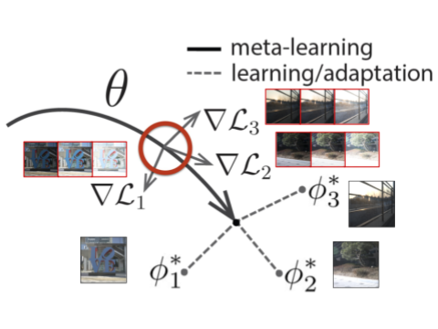

# MetaHDR: Model-Agnostic Meta-Learning for HDR Image Reconstruction
[](https://tenor.com/bkNeW.gif) [](https://tenor.com/bkNeW.gif)

| Poster Video                                                                                                | Poster PDF                                                                                                |
|------------------------------------------------------------------------------------------------------------|--------------------------------------------------------------------------------------------------------------------|
| [](https://www.youtube.com/watch?v=RvQIZ7aNOc0) | [](https://drive.google.com/file/d/1g1XR3ZRRs6CCAxeiSVdE6fcffyXVxdOh/view?usp=sharing) |

## Directory Structure
    .
    ├── configs                 # Stores yaml files for configuring training, evaluation, demo, etc.
    ├── data                    # Directory for data. See data.md for details on getting data.
    ├── materials               # Miscellaneous assets for the report, poster, video, etc.
    ├── scene_demo              # Small sample of input data used to demo adaptive forward-pass.
    ├── src                     # Jupyter notebook series explaining how apply radar concepts to real data.
    `── .
        ├── core                # Contains scripts used for configuration as well as the loss metrics used.
        ├── dataset             # Contains scripts used to read in the data, a data generator which will sample batches of data, as well as an hdr visualization script.
        ├── model               # Contains scripts which define the UNet for the inner model, as well as functions for training, validating, and evaluating our model with MAML.
    ├── scripts                 # Various setup scripts for mmwavestudio, etc
    ├── .gitignore
    ├── README.md
    ├── demo.py                 # Runs an adaptive forward pass to demonstrate deployed usage.
    ├── eval.py                 # Runs an evaluation of a trained model.
    ├── requirements.txt        # Required dependencies to run this model.
    └── train.py                # Runs training iterations.

## Getting Started
MetaHDR was implemented and tested on CentOS 7 with python >=3.9.0, and supports GPU and CPU computation. We have also provided a Colab demo for convenience.

First, clone the repository

```
git clone https://github.com/edwin-pan/MetaHDR.git
```

Next, install the requirements

```
pip install requirements.txt
```

## Running the Demo
The demo code provided runs MetaHDR on any LDR image input. We have provided a sample scene input directory at `./scene_demo`. LDR images need to be placed in `./scene_demo/LDR/` and the corresponding HDR labels should go to `./scene_demo/HDR/`. 

To run the demo,

```
python3 demo.py --input_folder ./scene_demo --output_folder ./scene_demo/output --cfg configs/config_demo.yaml
```

A new directory at `./scene_demo/output/` will contain the output HDR image.


## Running the Evaluation
Make sure that data is downloaded and formatted correctly (see `data.md`). 

To run evaluation,

```
python3 eval.py --model_dir <PATH-TO-TRAINING-OUTPUTS> --cfg <PATH-TO-CONFIG>
```

## Running the Training
Make sure that data is downloaded and formatted correctly (see `data.md`). Training scripts will log the 

To run training,

```
python3 train.py --cfg <PATH-TO-CONFIG>
```


## Google Colab


## Acknowledgement
This work was completed as a Final Project for EE 367 / CS 448I: Computational Imaging and Display at Stanford University. We would like to thank our professor, Dr. Gordon Wetzstein, for his valuable instruction throughout the quarter and our project mentor, Cindy Nguyen, for giving us insights into our project.

## Citation
```bibtex
@inproceedings{metahdr2021,
  title={MetaHDR: Model-Agnostic Meta-Learning for HDR Image Reconstruction},
  author={Pan, Edwin and Vento, Anthony},
  month={March},
  year={2021}
}
```

## References
A full list of references for this project can be found in the arxiv paper. 